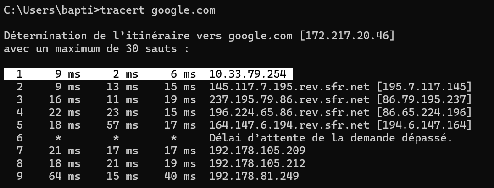
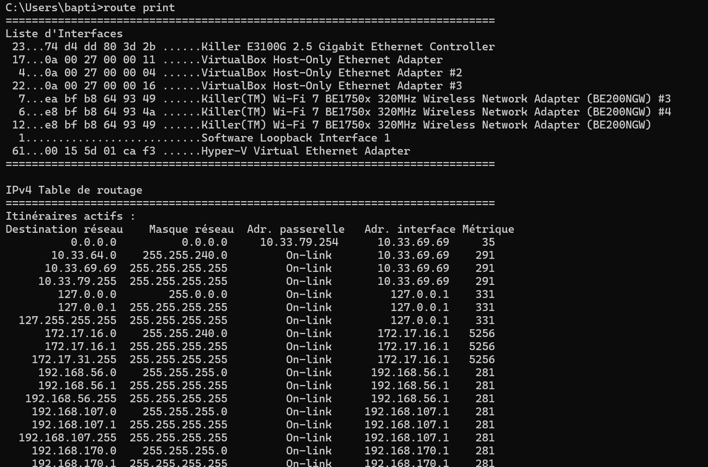
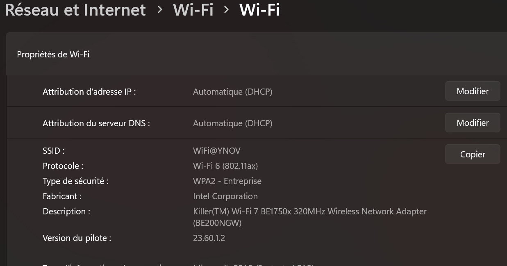
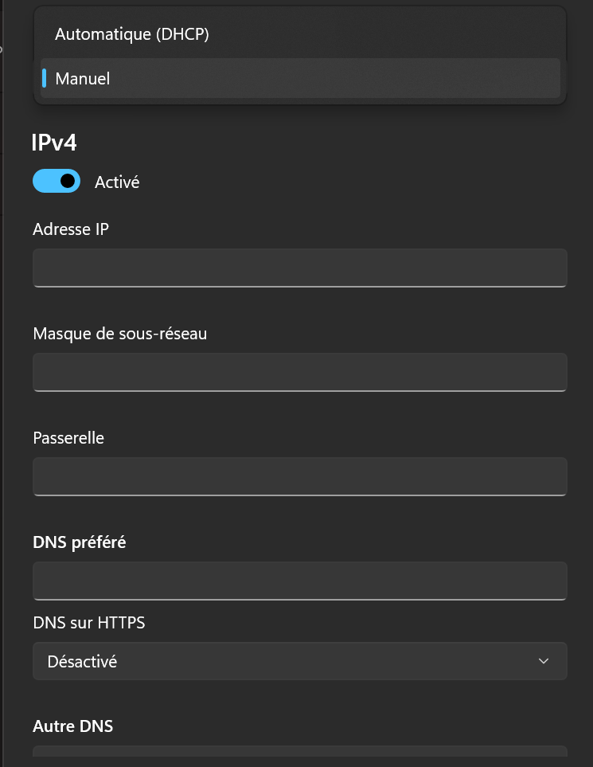
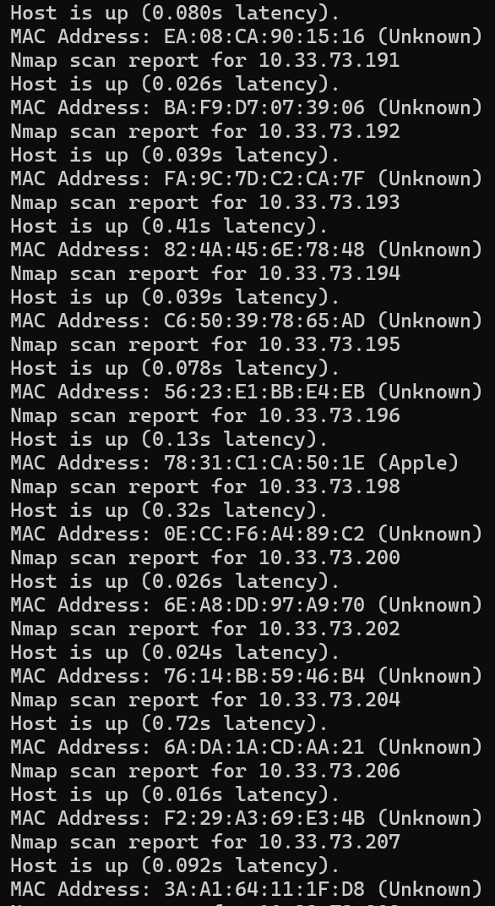
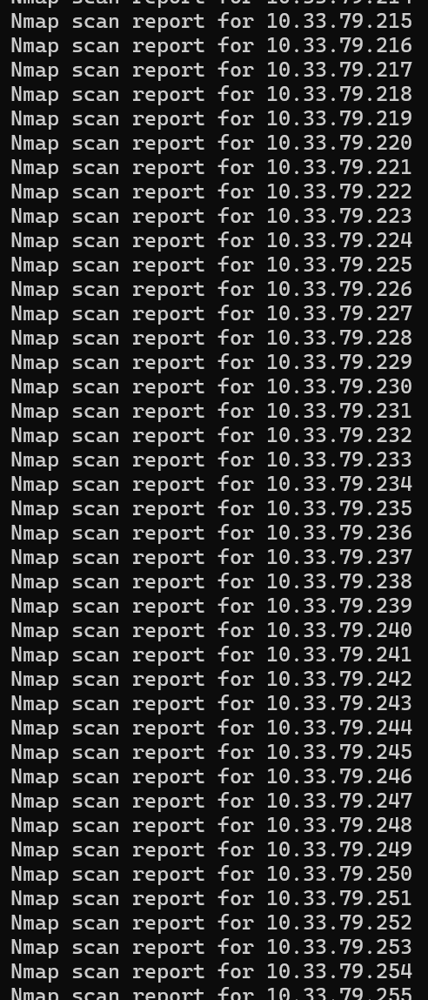
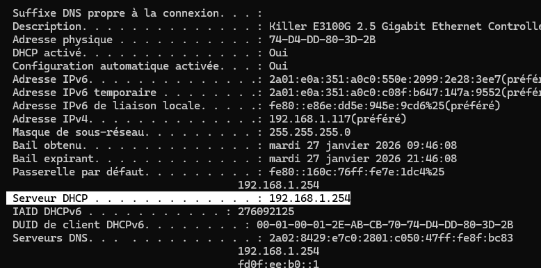
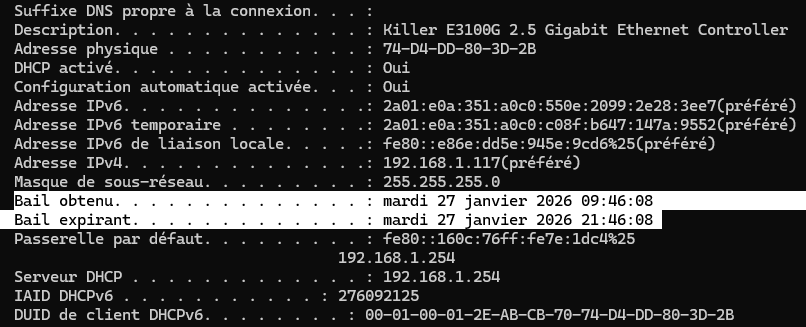
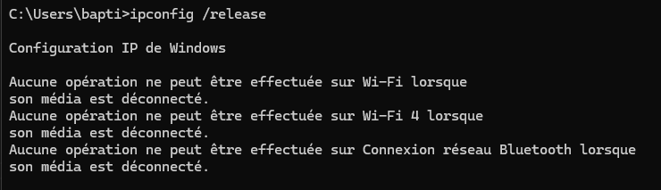
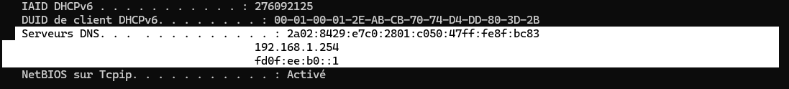

# TP Réseau I - Exploration locale en solo

## 1. Affichage d'informations sur la pile TCP/IP locale

### Configuration réseau actuelle

| Paramètre | Valeur |
|-----------|--------|
| **Carte réseau** | Wi-Fi |
| **Adresse IP** | `10.33.69.69` |
| **Masque de sous-réseau** | `255.255.240.0` |
| **Adresse MAC** | `E8:BF:B8:64:93:49` |
| **Adresse réseau** | `10.33.64.0/20` |
| **Broadcast** | `10.33.79.255` |

### Comment afficher les informations réseau sous Windows

**Méthode 1 : Interface graphique**
1. Panneau de configuration → Réseau et Internet → Centre Réseau et partage
2. Cliquer sur votre connexion → Détails
3. Ou : Paramètres → Réseau et Internet → WiFi → Propriétés

**Méthode 2 : Ligne de commande**
```powershell
ipconfig /all
```




### Rôle de la gateway dans le réseau Ingésup

La **gateway** (passerelle) joue un rôle crucial :
- Elle permet aux machines du réseau Ingésup de communiquer avec Internet
- C'est le routeur qui fait le lien entre le réseau local (LAN) et le réseau externe (WAN/Internet)
- Sans gateway configurée, on ne peut communiquer qu'avec les machines de notre réseau local

---

## 2. Modifications des informations réseau

### A. Calcul des adresses disponibles

**Calcul du nombre d'adresses :**
```
Réseau : 10.33.64.0/20
Nombre d'adresses utilisables : 2^(32-20) - 2 = 4094 adresses
```

**Plage d'adresses :**
- **Première adresse utilisable** : `10.33.64.1`
- **Dernière adresse utilisable** : `10.33.79.254`

>  **À exclure :** l'adresse réseau (`10.33.64.0`), l'adresse broadcast (`10.33.79.255`) et la gateway

### Configuration manuelle de l'IP sous Windows

1. **Accéder aux paramètres réseau**
   - Paramètres → Réseau et Internet → WiFi → Propriétés du matériel

   

2. **Passer en mode manuel**
   - Désactiver le mode automatique (DHCP)
   - Sélectionner IPv4 en mode manuel

   

3. **Saisir les informations**
   - Entrer la nouvelle adresse IP (qui ne doit pas être déjà utilisée)
   - Masque de sous-réseau
   - Gateway

---

### B. Scan réseau avec nmap

#### Scan des hôtes actifs
```bash
nmap -sn 10.33.64.0/20
```



**Résultat :** Liste de toutes les adresses IP utilisées et leurs hôtes associés.
>  **Note :** "Unknown" signifie que nmap n'a pas pu identifier le nom d'hôte.

**Exemples d'adresses IP libres détectées :**
- `10.33.73.197`
- `10.33.73.199`
- `10.33.73.205`

#### Liste complète des adresses (avec résolution DNS)
```bash
nmap -sL 10.33.64.0/20
```



---

### C. Modification de l'adresse IP via ligne de commande

#### Changement d'adresse IP
```powershell
netsh interface ip set address "Wi-Fi" static 10.33.73.197 255.255.240.0 10.33.79.254
```

Cette commande configure :
- **Nouvelle IP** : `10.33.73.197`
- **Masque** : `255.255.240.0`
- **Gateway** : `10.33.79.254`

#### Configuration du DNS
```powershell
netsh interface ip set dns "Wi-Fi" static 8.8.8.8
```

Cette commande permet d'avoir accès à Internet en configurant le serveur DNS de Google (`8.8.8.8`).

>  **Alternatives DNS :**
> - Google : `8.8.8.8` / `8.8.4.4`
> - Cloudflare : `1.1.1.1` / `1.0.0.1`

---

##  Vérification de la configuration

```powershell
# Afficher la nouvelle configuration
ipconfig /all

# Tester la connectivité
ping 8.8.8.8          # Test IP
ping google.com       # Test DNS
```

# TP Réseau II - Manipulations d'outils réseau côté client

## 1. DHCP - Dynamic Host Configuration Protocol

### Affichage des informations réseau

Pour obtenir toutes les informations réseau, y compris le serveur DHCP :

```cmd
ipconfig /all
```



> **Serveur DHCP identifié** : Cette commande affiche l'adresse IP du serveur DHCP qui a attribué votre configuration réseau actuelle.

---

### Dates d'expiration du bail DHCP

Le bail DHCP possède une durée de vie limitée, visible dans les informations suivantes :



**Informations affichées :**
- **Bail obtenu** : Date et heure d'attribution de l'adresse IP
- **Bail expirant le** : Date et heure d'expiration du bail

---

### Fonctionnement du protocole DHCP

Le serveur DHCP fonctionne selon un processus en **4 étapes** appelé **DORA** :

| Étape | Nom | Description |
|-------|-----|-------------|
|  **D** | **Discover** | Le client diffuse une demande d'IP sur le réseau |
|  **O** | **Offer** | Le serveur DHCP propose une adresse IP disponible |
|  **R** | **Request** | Le client accepte l'offre et demande cette IP |
|  **A** | **Acknowledge** | Le serveur confirme l'attribution de l'IP |

>  **Bon à savoir** : Le bail DHCP est temporaire, généralement valable entre **24 heures et 7 jours**.

---

###  Renouvellement de l'adresse IP

Pour demander une nouvelle adresse IP en ligne de commande :

```cmd
ipconfig /release
ipconfig /renew
```



>  **Attention** : Il faut impérativement être connecté en **WiFi**. Si vous êtes sur **câble Ethernet**, cette manipulation ne fonctionnera pas correctement dans certains environnements réseau.

---

## 2. DNS - Domain Name System

###  Identification du serveur DNS

Pour afficher l'adresse du serveur DNS configuré :

```cmd
ipconfig /all
```



> Le serveur DNS est responsable de la résolution des noms de domaine en adresses IP.

---

###  Requêtes DNS - Lookup standard

#### Résolution de noms de domaine

```cmd
nslookup google.com
nslookup ynov.com
```

**Résultat obtenu :**
- L'adresse IP des serveurs web est affichée
- Peut retourner une seule adresse ou plusieurs (CDN - Content Delivery Network)

** Interprétation :**
- **Google.com** : Utilise généralement plusieurs adresses IP pour la répartition de charge
- **Ynov.com** : Affiche l'adresse du serveur web, potentiellement via un CDN

---

###  Requêtes DNS - Reverse Lookup

#### Résolution inverse (IP vers nom de domaine)

```cmd
nslookup 78.78.21.21
nslookup 92.16.54.88
```

**Résultat possible :**
-  Si un **enregistrement PTR** existe → Le nom de domaine associé est affiché
-  Sinon → Erreur ou message **"Non-existent domain"**

