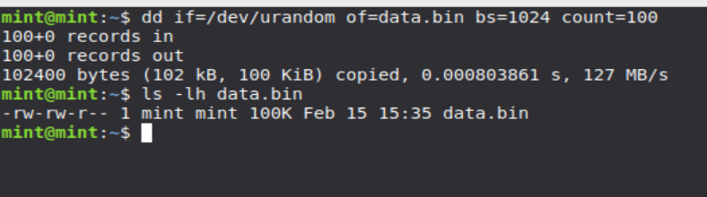
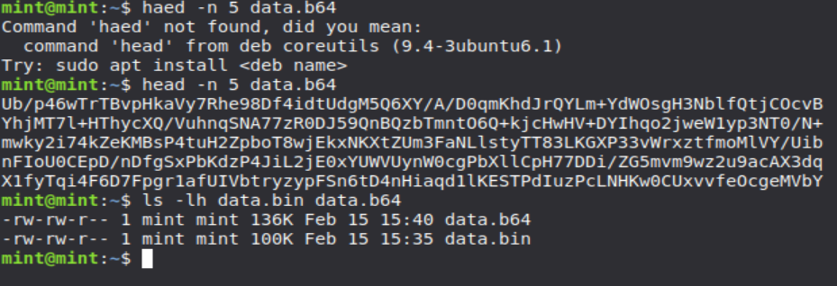
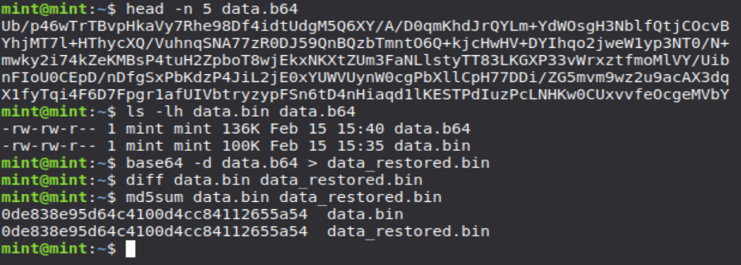
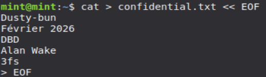

# A. Base64

## 1. Génération d’un fichier binaire



## 2. Encodage



## 3. Décodage



## 4. Réponses aux questions
                     
### Q1: Base64 est-il un chiffrement ? Pourquoi ?

Non, Base64 n'est PAS un chiffrement, c'est un ENCODAGE.
Différences:
- Le chiffrement nécessite une clé secrète pour être inversé
- L'encodage Base64 peut être inversé par n'importe qui sans clé
- Base64 sert uniquement à représenter des données binaires en texte ASCII
- Il n'y a aucune sécurité: tout le monde peut décoder du Base64
- Le chiffrement protège la confidentialité, l'encodage non

### Q2: Pourquoi la taille du fichier change-t-elle après encodage ?

Base64 encode des données binaires (8 bits par octet) en utilisant uniquement
64 caractères ASCII (6 bits d'information par caractère).
- 3 octets binaires (24 bits) → 4 caractères Base64 (24 bits)
- Augmentation théorique: 33.33%
- Augmentation réelle: ~36% à cause des retours à la ligne ajoutés

### Q3: Quel est approximativement le pourcentage d'augmentation ?

Calcul:
- Taille originale: 100 Ko = 102400 octets
- Taille encodée: 136 Ko = 139264 octets
- Augmentation: (139264 - 102400) / 102400 × 100 = 36%

L'augmentation théorique minimale est de 33.33%, mais avec les retours à la 
ligne ajoutés tous les 76 caractères, on obtient environ 36%.

### Q4: Quelle méthode permet de vérifier rigoureusement que deux fichiers sont identiques ?

Plusieurs méthodes:
1. diff: compare octet par octet (retour vide = identiques)
2. Fonctions de hachage cryptographique:
   - md5sum: génère une empreinte unique
   - sha256sum: plus sécurisé que MD5
   - sha512sum: encore plus sécurisé
3. cmp: compare binaire bit par bit

Les fonctions de hachage sont les plus rigoureuses car elles génèrent une 
empreinte mathématique unique pour chaque fichier.

# B. Chiffrement symétrique - AES

## 1. Création d'un message



## 2. Chiffrement

```bash
openssl enc -aes-256-cbc -salt -pbkdf2 -in confidentiel.txt -out confidentiel.enc -pass: pass: *****
file confidentiel.enc
od -A x -t x1z -v confidentiel.enc | head -n 5
```

## 3. Déchiffrement

```bash
openssl enc -aes-256-cbc -d -pbkdf2 -in confidentiel.enc -out confidentiel_dechiffre.txt -pass pass: *****
diff confidentiel.txt confidentiel_dechiffre.txt
```

## 4. Analyse

```bash
openssl enc -aes-256-cbc -salt -pbkdf2 -in confidentiel.txt -out confidentiel2.enc -pass: *****
diff confidentiel.enc confidentiel2.enc
od -A x -t x1z -v confidentiel.enc | head -n 2
od -A x -t x1z -v confidentiel2.enc | head -n 2
```

## 5. Réponses aux questions


