### 1.1 Installation du serveur SSH

Sur la VM :
```bash
sudo apt update
sudo apt install openssh-server -y
```

### 1.2 Vérification du service

```bash
sudo systemctl status ssh
ss -tlnp | grep ssh
```

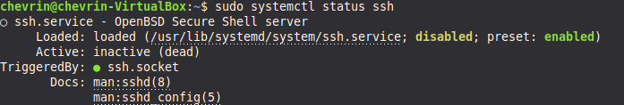

### 1.3 Trouver l'IP de la VM

```bash
ip a
```
---

## Partie 2 – Connexion SSH

### 2.1 Première connexion depuis Windows

```cmd
ssh chevrin@10.157.3.118
```

### 2.2 Génération de clés SSH sur Windows

```cmd
ssh-keygen -t ed25519
```

- `C:\Users\bapti\.ssh\id_ed25519` (clé privée)
- `C:\Users\bapti\.ssh\id_ed25519.pub` (clé publique)

### 2.3 Copie de la clé publique sur la VM

```cmd
type %USERPROFILE%\.ssh\id_ed25519.pub | ssh chevrin@10.157.3.118 "mkdir -p ~/.ssh && cat >> ~/.ssh/authorized_keys"
```

### 2.4 Test de connexion sans mot de passe

```cmd
ssh chevrin@10.157.3.118
```

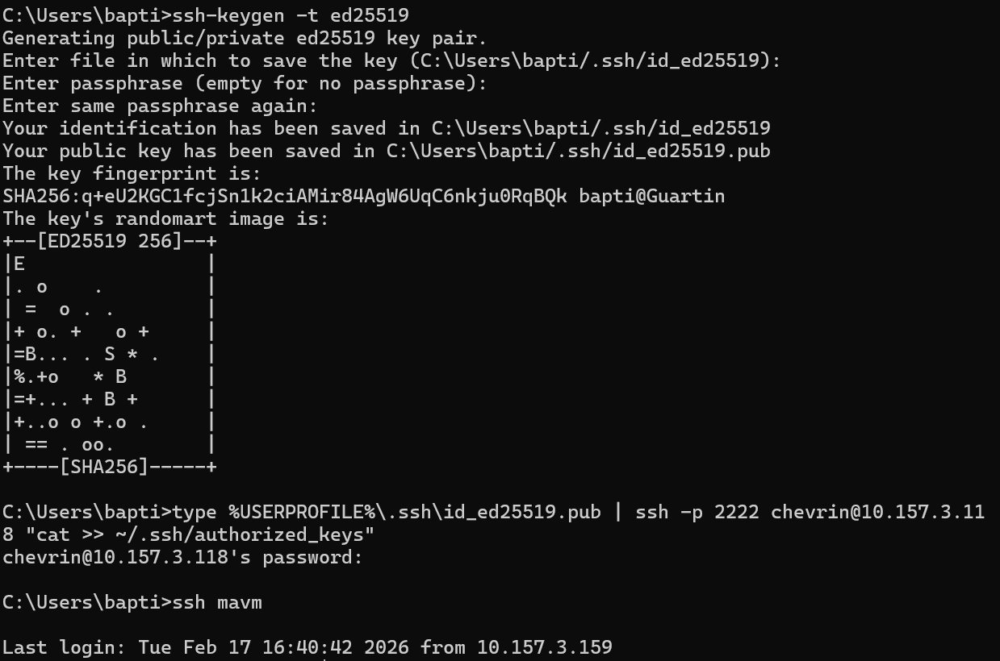

---

## Partie 3 – Sécurisation SSH

### 3.1 Modification de la configuration SSH

```bash
sudo nano /etc/ssh/sshd_config
```

Modifications apportées :
```
Port 2222
PermitRootLogin no
PasswordAuthentication no
```
En nano pour enregistrer le fichier il faut 
    - ctrl O
    - entrée
    - ctrl X

### 3.2 Redémarrage du service SSH

```bash
sudo systemctl daemon-reload
sudo systemctl restart ssh.socket
```

Vérification :
```bash
ss -tlnp | grep ssh
```

### 3.3 Test de connexion sur le nouveau port

Depuis Windows :
```cmd
ssh -p 2222 chevrin@10.157.3.118
```

### 3.4 Création d'un alias SSH

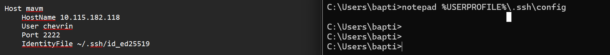

```cmd
ssh mavm
```

Pour ce déconnecter rapidement ctrl D

---

## Partie 4 – Transfert de fichiers

### 4.1 Préparation des fichiers de test


### 4.2 SCP (Secure Copy)

**Envoyer un fichier :**

```cmd
scp -P 2222 fichier.txt chevrin@10.157.3.118:/home/chevrin/
```

**Envoyer un dossier :**

```cmd
scp -P 2222 -r mondossier chevrin@10.157.3.118:/home/chevrin/
```

**Récupérer un fichier :**

```cmd
scp -P 2222 chevrin@10.157.3.118:/home/chevrin/fichier.txt C:\Users\bapti\Downloads\
```

### 4.3 SFTP (SSH File Transfer Protocol)

```cmd
sftp -P 2222 chevrin@10.157.3.118
```


### 4.4 RSYNC (Synchronisation)


```bash
mkdir ~/source ~/destination
echo "test rsync" > ~/source/test.txt
rsync -avz ~/source/ ~/destination/
```
---

## Partie 5 – Logs et Fail2Ban

### 5.1 Analyse des logs SSH

```bash
sudo tail -f /var/log/auth.log
grep "Accepted" /var/log/auth.log
grep "Failed" /var/log/auth.log
```

### 5.2 Installation de Fail2Ban

```bash
sudo apt update
sudo apt install fail2ban -y
sudo systemctl status fail2ban
```

### 5.3 Configuration de Fail2Ban

```bash
sudo cp /etc/fail2ban/jail.conf /etc/fail2ban/jail.local
sudo nano /etc/fail2ban/jail.local
```

Configuration de la jail `[sshd]` :
```ini
[sshd]
enabled  = true
port     = 2222
maxretry = 3
findtime = 60
bantime  = 120
```

Pour rechercher dans nano un text précis ctrl W


```bash
sudo systemctl restart fail2ban
```

### 5.4 Vérification et gestion des bannissements

```bash
sudo fail2ban-client status sshd
sudo tail -f /var/log/fail2ban.log
sudo fail2ban-client set sshd unbanip 10.157.3.XXX
```

---

## Partie 6 – Tunnels SSH

### 6.1 Préparation – Installer Apache

```bash
sudo apt install apache2 -y
sudo systemctl start apache2
```

### 6.2 Tunnel Local

Permet d'accéder à un service de la VM depuis Windows.

```cmd
ssh -L 8080:localhost:80 -p 2222 chevrin@10.157.3.118
```

Tester dans le navigateur : `http://localhost:8080`

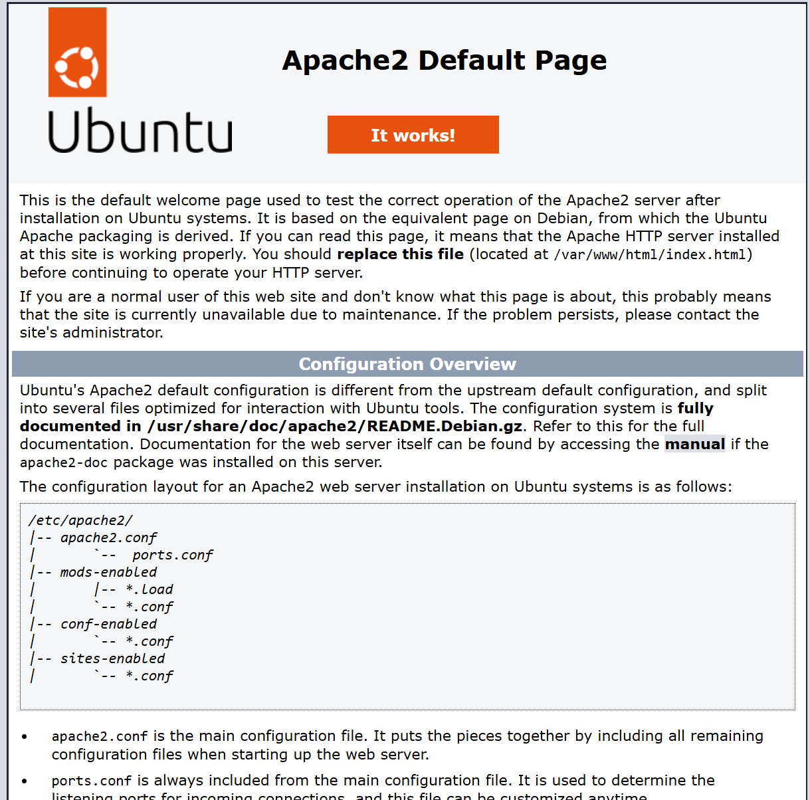

### 6.3 Tunnel Distant

```cmd
ssh -R 9090:localhost:3389 -p 2222 chevrin@10.157.3.118
```

### 6.4 Tunnel Dynamique (Proxy SOCKS5)

```cmd
ssh -D 1080 -p 2222 chevrin@10.157.3.118
```

---

## Partie 7 – Nginx + HTTPS

### 7.1 Installation de Nginx

```bash
sudo apt install nginx -y
sudo systemctl start nginx
sudo systemctl enable nginx
```

### 7.2 Création du site

```bash
sudo mkdir -p /var/www/site-tp
sudo nano /var/www/site-tp/index.html
```

Contenu du fichier `index.html` :
```html
<!DOCTYPE html>
<html lang="fr">
<head>
    <meta charset="UTF-8">
    <title>Site TP</title>
</head>
<body>
    <h1>Hello World</h1>
</body>
</html>
```

### 7.3 Configuration HTTP

```bash
sudo nano /etc/nginx/sites-available/site-tp
```
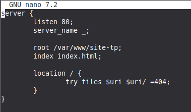

```bash
sudo ln -s /etc/nginx/sites-available/site-tp /etc/nginx/sites-enabled/
sudo rm /etc/nginx/sites-enabled/default
sudo nginx -t
sudo systemctl restart nginx
```

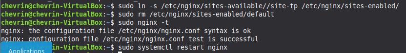

### 7.4 Génération du certificat SSL auto-signé

```bash
sudo mkdir -p /etc/nginx/ssl
sudo openssl req -x509 -nodes -days 365 -newkey rsa:2048 -keyout /etc/nginx/ssl/site-tp.key -out /etc/nginx/ssl/site-tp.crt
```

Informations saisies :
- Country Name: `FR`
- State: `IDF`
- Locality: `Paris`
- Organization: `TP`
- Common Name: `10.115.183.118`

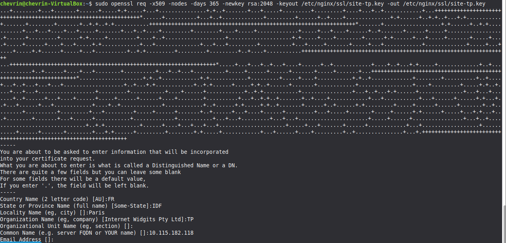

Si l'on lance le site sur un navigateur on peut avoir le certificat
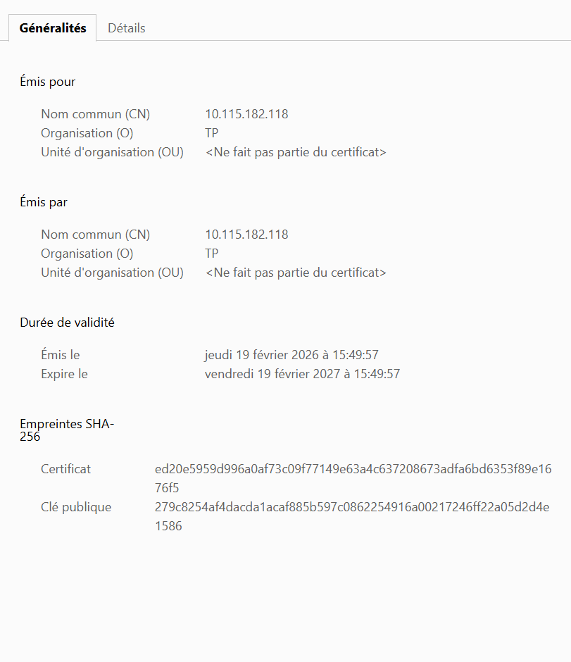

### 7.5 Configuration HTTPS + redirection

```bash
sudo nano /etc/nginx/sites-available/site-tp
```

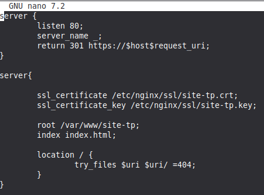

```bash
sudo nginx -t
sudo systemctl restart nginx
```

### 7.6 Arrêt d'Apache (conflit de port)

```bash
sudo systemctl stop apache2
sudo systemctl disable apache2
```

### 7.7 Tests

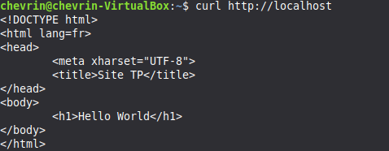
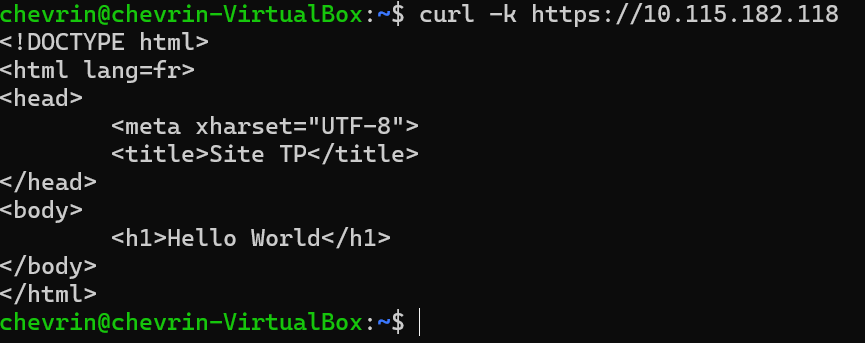

---

## Partie 8 – Firewall et permissions

### 8.1 Configuration du firewall UFW

```bash
sudo ufw enable
```
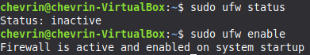

```
sudo ufw allow 2222/tcp
sudo ufw allow 'Nginx Full'
sudo ufw status verbose
```
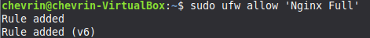


### 8.2 Permissions sur le site web

```bash
sudo chown -R www-data:www-data /var/www/site-tp
sudo chmod -R 755 /var/www/site-tp
ls -la /var/www/site-tp
```

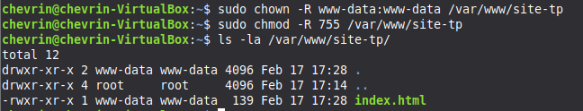

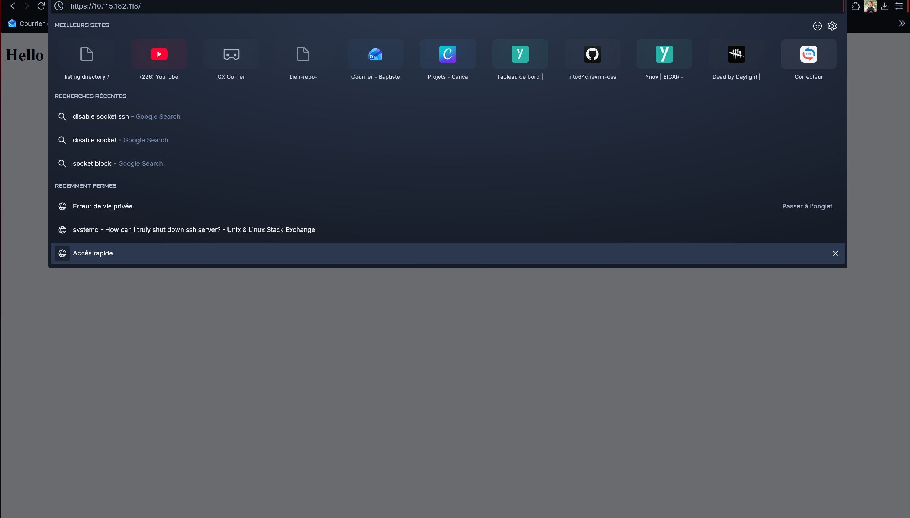

