# Partie 1 : Comprendre la PKI

## 1.1 Questions

### À quoi sert une autorité de certification (CA) ?

- Il s'agit d'une entité qui valide l'identité numérique de sites web, d'adresses électroniques, d'entreprises ou d'individus

### Quelle différence entre clé privée et certificat ?

- Les certificats numériques servent d'identifiants électroniques qui valident l'identité d'individus, d'organisations ou de sites Web. Les clés privées sont utilisées pour générer des signatures numériques, qui vérifient l'authenticité et l'intégrité des données transmises sur Internet

### Pourquoi un serveur VPN a-t-il besoin de certificats ?

- Les certificats sont utilisés pour authentifier le serveur VPN et le serveur Net Promoter Score (NPS) auprès des clients, et pour authentifier les utilisateurs auprès du serveur VPN

## 1.2 Environnement PKI

### Créer un environnement PKI

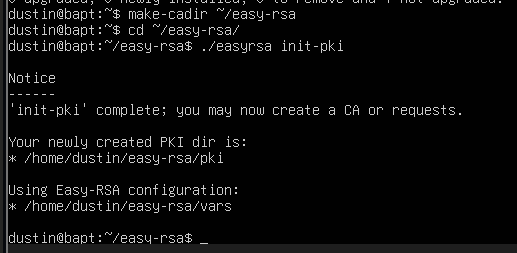

### CA

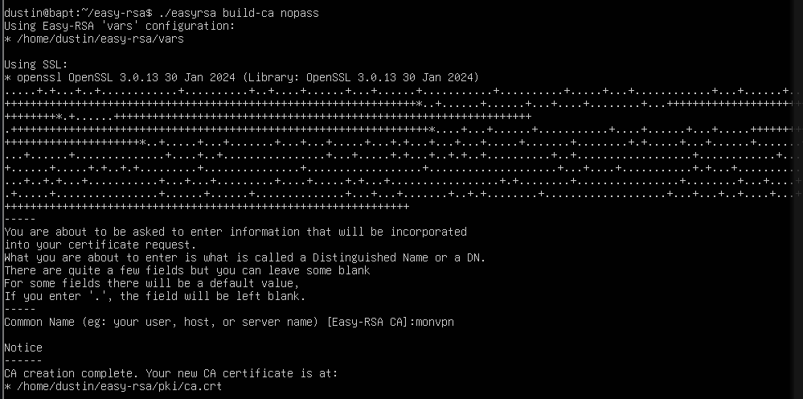

### certificat serveur

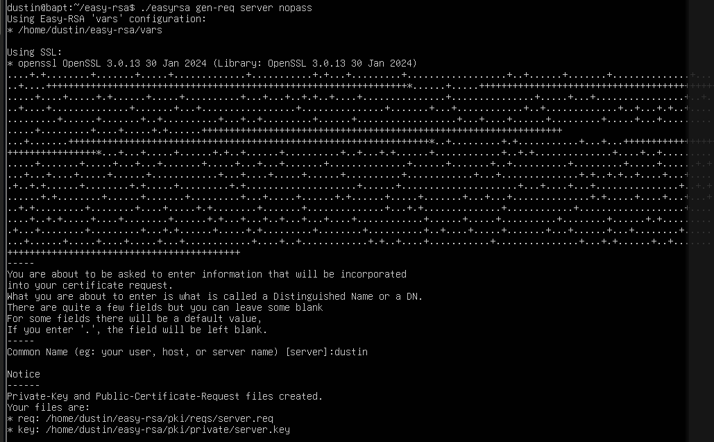

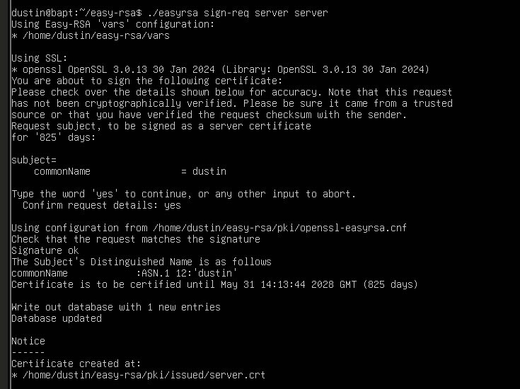

### certificat client

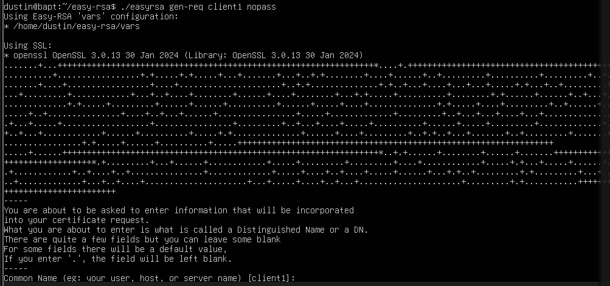

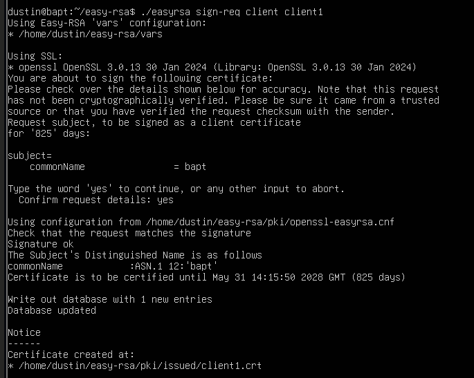

### Diffie-Hellman


### clé TLS

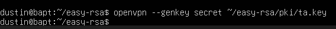

## 1.3 Questions


### Où Easy-RSA crée-t-il ses fichiers ?

-  ~/easy-rsa/pki/

### Que contient le dossier pki/ ?

- ca.crt : le certificat de la CA
- private/ca.key : la clé privée de la CA (à protéger absolument)
- issued/*.crt : les certificats signés (serveur, clients)
- private/*.key : les clés privées correspondantes
- dh.pem : les paramètres Diffie-Hellman
- reqs/*.req : les requêtes de signature

### Quelle est la différence entre gen-req et sign-req ?

- gen-req génère une paire clé privée + requête de signature (CSR). sign-req prend cette requête et la signe avec la CA pour produire un certificat valide

### Que se passe-t-il si vous oubliez de signer un certificat ?

- OpenVPN refusera la connexion : il a une requête (.req) mais pas de certificat (.crt) valide reconnu par la CA

# Partie 2 : Configuration du serveur OpenVPN

## 2.1 Fichier conf serveur

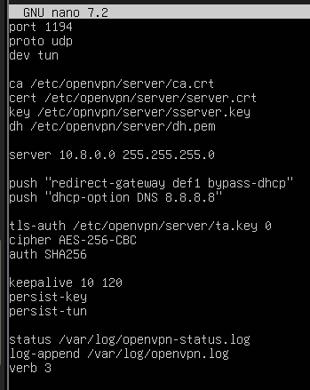

## 2.2 Questions

### Que signifie dev tun ?

- Crée une interface réseau virtuelle en mode "tunnel"

### Quelle est la différence entre UDP et TCP pour un VPN ?

- UDP est plus rapide, à moins de latence, et évite le problème "TCP over TCP" (si le tunnel TCP perd des paquets, les retransmissions TCP internes et externes s'accumulent et réduit les performances)
- TCP est utile seulement si UDP est bloqué par un pare-feu.

### Quelle plage IP choisir pour le VPN ? Pourquoi ?

- 10.8.0.0/24 est une convention courante, pour éviter les conflits de routage

## 2.3 Routage et NAT

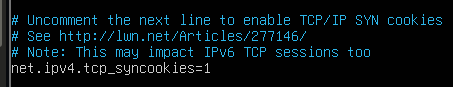

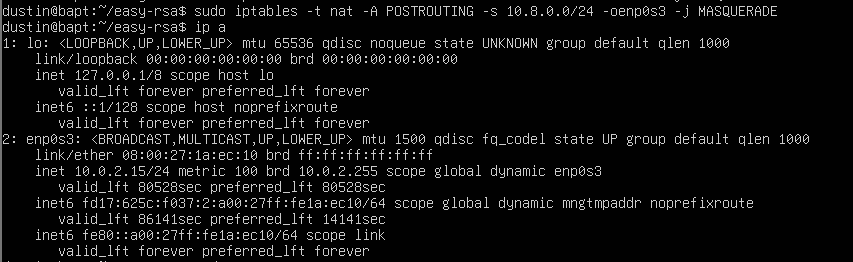

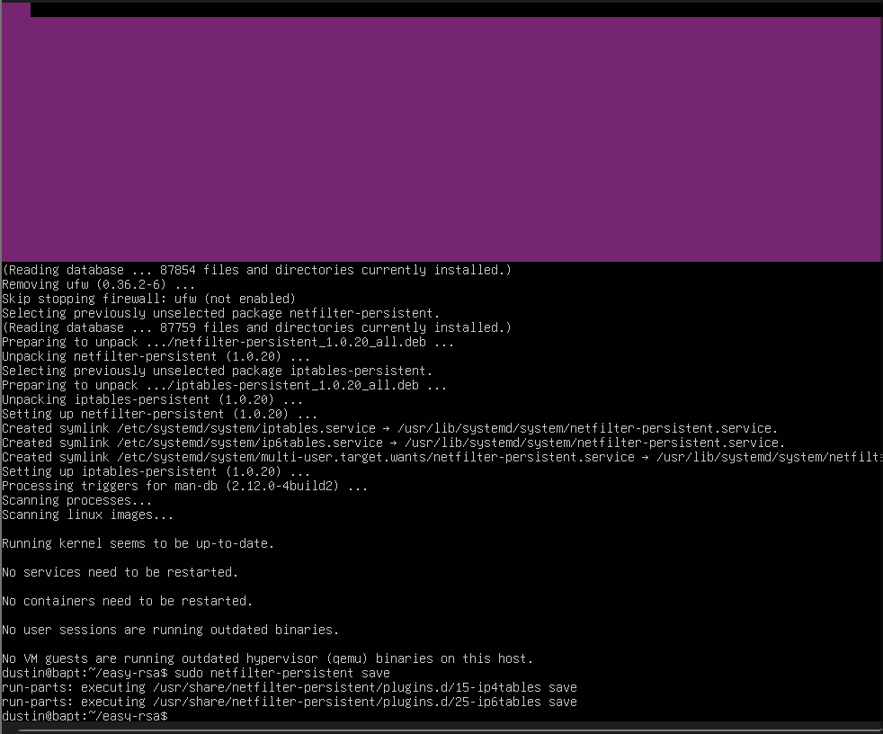

## 2.4 Questions

### Où se configure le paramètre ip_forward ?

- Dans /etc/sysctl.conf

### Quelle commande permet d'afficher les règles NAT actuelles ?

```bash
    sudo iptables -t nat -L -v -n
```

### Pourquoi faut-il "masquerader" le réseau VPN ?

- Les clients VPN ont des IP lié au réseau 10.8.0.0, inconnues d'Internet. Le masquerade (SNAT dynamique) remplace l'IP source du client par l'IP publique du serveur, pour que les réponses puissent revenir. Sans ça, les paquets partent mais les réponses ne savent pas où revenir

## 2.5 Démarrage et analyse du service

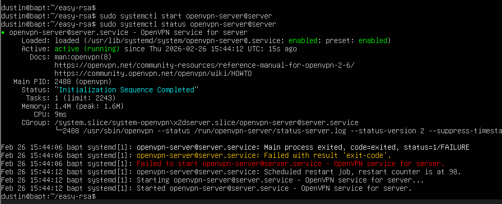

# Partie 3 : Création du profil client

## 3.1 Fichier .ovpn

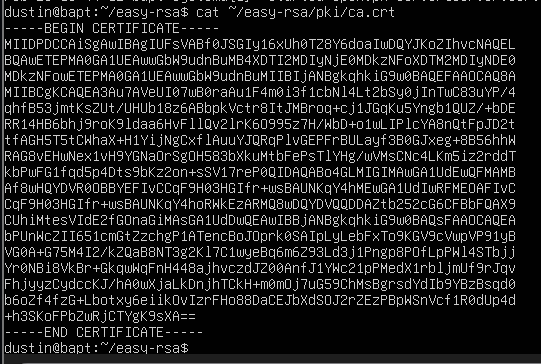


```bash
    cat ~/easy-rsa/pki/issued/client1.crt
```
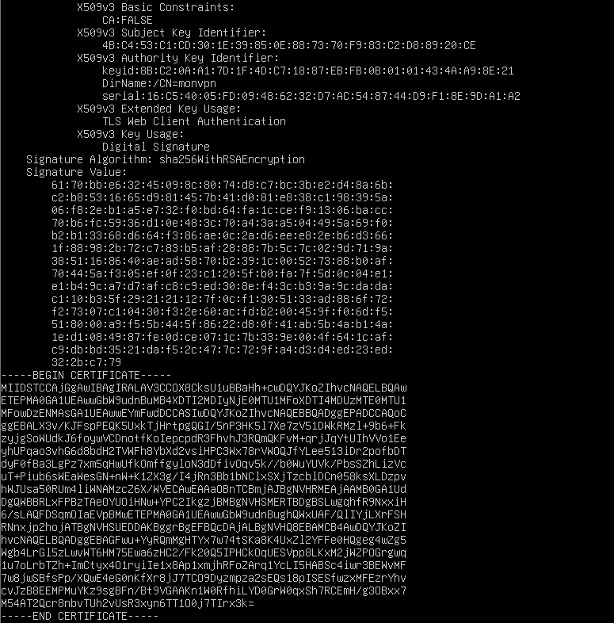

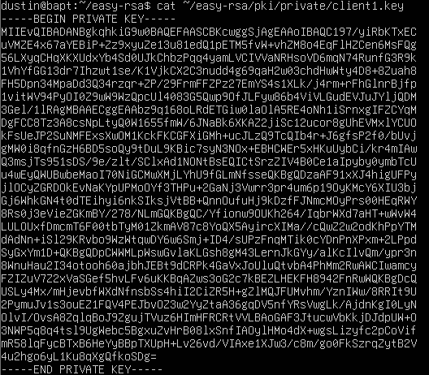

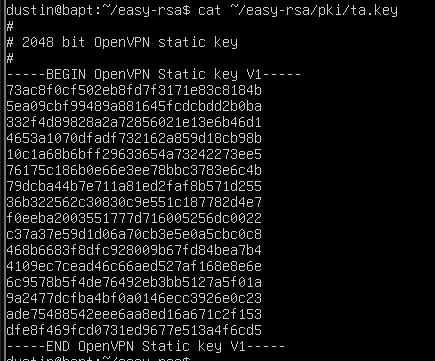

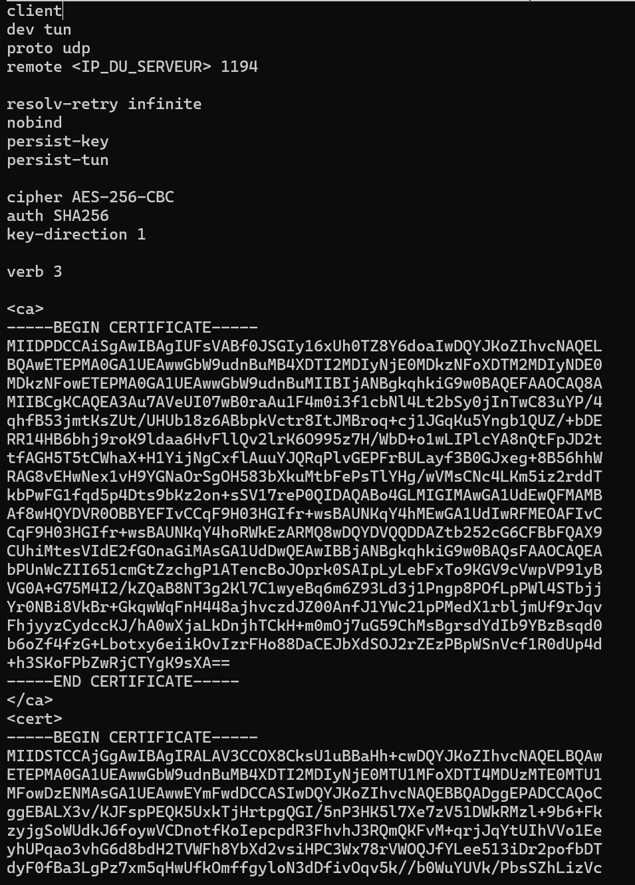

## 3.2 Questions

### Comment intégrer un certificat directement dans un fichier .ovpn ?

- En utilisant les balises <ca>, <cert>, <key>, <tls-auth> qui encapsulent directement le contenu PEM

### Pourquoi la clé privée ne doit-elle jamais être partagée publiquement ?

- Quiconque possède la clé privée peut se faire passer pour le client légitime. La sécurité du VPN repose entièrement sur le secret de cette clé.

## 3.3 Tests et validation

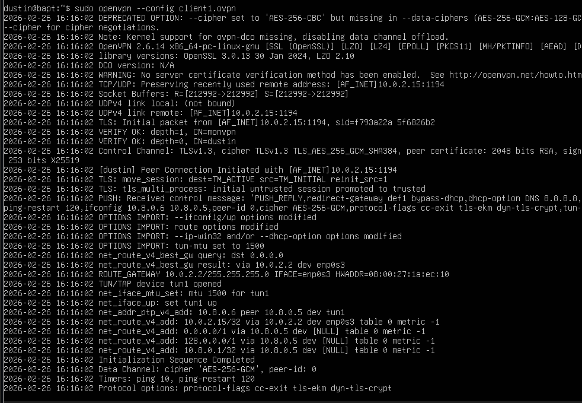


## 3.4 Questions

### Comment vérifier que votre trafic passe par le VPN ?

- Comparer l'IP publique avant/après connexion avec curl ifconfig.me. On peut aussi faire traceroute 8.8.8.8 et vérifier que le premier saut est la passerelle VPN (10.8.0.1)

### Que se passe-t-il si le port 1194 est bloqué ?

- Le client ne peut pas établir la connexion il faut donc passer en TCP sur le port 443 qui est rarement filtré car utilisé par HTTPS 
